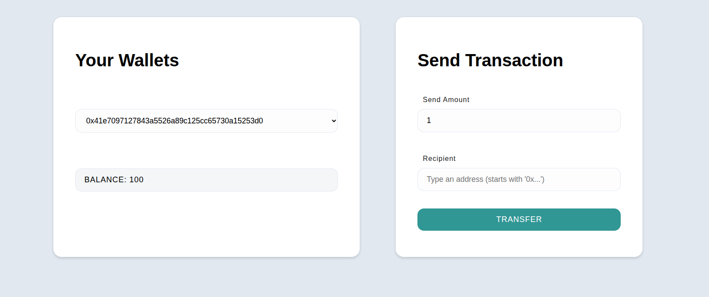

# ECDSA Node - Cryptography Learning Project

## Overview

This is a client-server web application for learning Elliptic Curve Digital Signature Algorithm (ECDSA) implementation. It simulates a simple cryptocurrency transfer system with cryptographic security, demonstrating digital signatures and public key cryptography concepts.

## Architecture

### Client (`/client`)
- **React + Vite** frontend application
- **Components:**
  - `Wallet.jsx` - Wallet selection dropdown
  - `Transfer.jsx` - Transaction form for sending funds  
  - `App.jsx` - Main app component coordinating wallet and transfer
- Uses `ethereum-cryptography@1.2.0` library

### Server (`/server`)
- **Express.js** backend with CORS enabled
- **Key Features:**
  - Generates 3 wallets with random private keys at startup
  - Converts public keys to Ethereum-style addresses
  - Signs transactions server-side using private keys
  - Verifies signatures by recovering public keys

## Current Implementation Status

This project has **completed Phase 3** and implements:

**Digital Signatures**: Server-side transaction signing with ECDSA  
**Public Key Recovery**: Signature verification through public key recovery  
**Ethereum-style Addresses**: Proper address generation from public keys  
**Secure Transfers**: Only authenticated transactions are processed

## Security Design

- Private keys never leave the server
- Transactions are signed server-side and verified
- Uses Keccak256 hashing and secp256k1 elliptic curve
- Prevents unauthorized transfers through signature verification

## Setup Instructions

### Client

1. Open a terminal in the `/client` folder
2. Run `npm install` to install all dependencies
3. Run `npm run dev` to start the application
4. Visit http://localhost:5173/

### Server

1. Open a terminal in the `/server` folder
2. Run `npm install` to install all dependencies
3. Run `node index` to start the server

**Tip:** Install nodemon globally (`npm i -g nodemon`) and run `nodemon index` for auto-restart on changes.

## How It Works

1. **Wallet Generation**: Server creates 3 wallets with random private keys and Ethereum addresses
2. **Wallet Selection**: Users select from available wallets in the dropdown
3. **Transaction Creation**: Users specify recipient and amount
4. **Server-side Signing**: Server signs the transaction using the sender's private key
5. **Signature Verification**: Server recovers the public key from signature and validates against the sender address
6. **Balance Update**: If verification passes, balances are updated

--------------------------------
--------------------------------
## Note

This repository is developed as part of [Alchemy Academy](https://www.alchemy.com/university) coursework and is meant for educational demonstration purposes only.